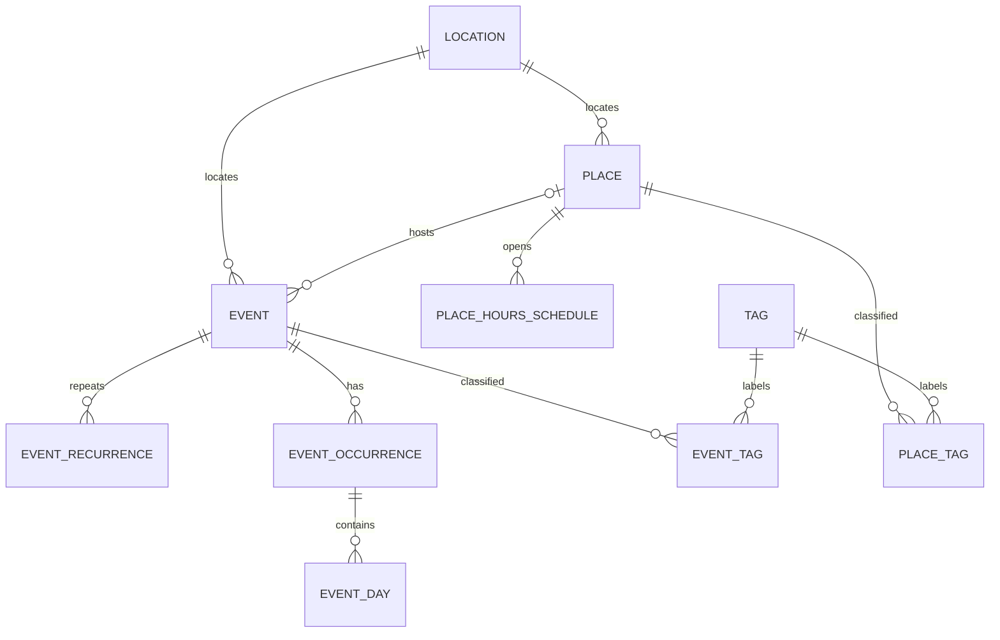

# Event and place schema proposal

Status: Initial schema and API implemented, 2026-09-10. This document records
the design; [the API guide](../api/domain-endpoints.md) describes the implemented
inputs, endpoints, limits, and validation. Authentication follows the local
`pa-libertybells-250` Better Auth pattern with Drizzle-backed users and sessions.

The existing architecture selects Neon/PostGIS and Drizzle, with events and
places as separate modules. This proposal preserves those boundaries.

## Core model

An **event** is the enduring identity: for example, a town's annual craft fair.
An **occurrence** is one edition of that event. An occurrence contains **days**,
each with optional descriptive text and one continuous availability interval
when its hours are known. Friday,
Saturday, and Sunday belong to one occurrence, even when their hours differ.
A one-off event has one occurrence and no recurrence rule.

Design decision: event times live directly on days. Split opening periods and
multiple showtimes within the same event day are outside the initial scope.

A **place** is a reusable destination with its own identity, opening hours,
visibility, and optional admission costs. A **location** is an address and
geographic point. A temporary event site needs a location without requiring a
place listing.

The diagram shows primary relationships; occurrence venue overrides, pricing,
and opening-hours child tables are described below.

## Proposed tables

All entity tables use UUID primary keys and creation/update timestamps. Join
tables use composite keys. Required fields are non-null unless marked optional.

| Table | Principal fields and purpose |
| --- | --- |
| `locations` | `id`, `label`, optional structured address, `coordinates geography(Point,4326)`. Require a point for map/routing support. Locations are exposed through authorized parent records, with no independent public listing. |
| `places` | `id`, `owner_id`, `name`, optional `description`, `visibility` (`public`/`private`), `location_id`, IANA `timezone`. |
| `events` | `id`, `owner_id`, `title`, optional `description`, `visibility`, `location_id`, optional `place_id`, IANA `timezone`. Venue and zone are defaults for occurrences. |
| `event_recurrences` | `id`, `event_id`, `mode` (`scheduled`/`expected`), local anchor date/time, optional `rrule`, optional effective end. Expected mode instead stores a positive month interval; 12 means an annual expectation. |
| `event_recurrence_days` | `id`, `recurrence_id`, nonnegative `day_offset`, optional `description`, `time_kind` (`timed`/`all_day`/`unknown`), optional local `start_minute` (0–1439) and `end_minute` (up to 2880 for overnight endings). Unique `(recurrence_id, day_offset)`. Template relative to the recurrence anchor. |
| `event_occurrences` | `id`, `event_id`, optional `recurrence_id`, optional original recurrence anchor, `status` (`scheduled`/`tentative`/`cancelled`), `date_precision` (`exact`/`month`), optional exact start/end dates, optional `expected_month`, `location_id`, optional `place_id`, `timezone`, optional title/description overrides. |
| `event_days` | `id`, `occurrence_id`, local `date`, optional `description`, `time_kind`, optional `starts_at` and `ends_at` as `timestamptz`. Known hours require both timestamps and `ends_at > starts_at`. Unique `(occurrence_id, date)`. |
| `place_hours_schedules` | `id`, `place_id`, local effective date range, optional label such as “Summer 2027”. |
| `place_hours_weekdays` | `id`, `schedule_id`, weekday, `state` (`open`/`closed`/`unknown`). Unique schedule/weekday. |
| `place_hours_intervals` | `id`, `weekday_id`, local opening/closing times, end-day offset. Multiple intervals allow a lunch break. |
| `place_hours_exceptions` | `id`, `place_id`, local `date`, `state`, optional note. Unique place/date. Replaces the day's regular hours. |
| `place_hours_exception_intervals` | `id`, `exception_id`, local opening/closing times, end-day offset. |
| `tags` | `id`, unique normalized `slug`, display `name`. Shared controlled vocabulary. |
| `event_tags` | `event_id`, `tag_id`; composite primary key and actual foreign keys. |
| `place_tags` | `place_id`, `tag_id`; composite primary key and actual foreign keys. |

Identity resolves the current Better Auth session to an actor subject. Event
and place `owner_id` columns reference the Better Auth `user` table. Private
means owner-only; collaborator or household sharing would need explicit grants.

## Recurrence and uncertain dates

Scheduled recurrence generates occurrence anchors from an RRULE and a local
time zone. The template then supplies each day's hours and description.
Daily, weekly, monthly, and yearly frequencies need an interval and calendar
selectors, rather than a fixed list of recurrence labels. For example:

- Every other week: `FREQ=WEEKLY;INTERVAL=2`.
- Every two years: `FREQ=YEARLY;INTERVAL=2`.

The requested “bi yearly” means every two years. Expected recurrence can also
use a 24-month interval when that event's next exact dates are unknown.

These follow [RFC 5545 recurrence rules](https://www.rfc-editor.org/rfc/rfc5545#section-3.3.10).
Store one canonical rule representation, validate supported combinations, and
use a tested recurrence evaluator when implementing. An absent end means an
unbounded rule, not an instruction to insert infinite rows.

Expected recurrence is a different promise: the event is expected to return,
but its next dates are not announced. After an event in September 2026, create
one tentative occurrence with `expected_month = 2027-09-01` and
`date_precision = month`. The first of the month is a storage convention for
year/month, never a displayed event date. Exact dates and day rows
are absent. Do not copy last year's daily times into it.

When dates are announced, update that same occurrence to exact dates and add
its days. Preserve its ID for saved items and links. A stale placeholder stays
unconfirmed; it does not silently become a scheduled event. Default expected
cadence is 12 months, subject to explicit recurrence configuration.

For scheduled series, expand only the requested date window, including enough
lookback to catch multi-day occurrences starting before it. Persist authored
occurrences and exceptions; unmodified generated occurrences may remain
virtual. Use `(recurrence_id, original_anchor)` as a unique stable identity for
an override, even when moved to another date. Stored overrides replace the
virtual result; cancelled rows suppress it. Query moved overrides by their
actual dates as well as expanding rules. Expected placeholders use the
expected month as their original anchor, retained after confirmation.

Changing “this and future occurrences” closes the old recurrence segment and
creates a new one. Existing explicit overrides need deliberate reconciliation;
historical schedules are not rewritten. Recurrence templates must not generate
an occurrence that overlaps the next one unless explicitly allowed.

Month-end and leap-day behavior follows the selected recurrence policy; do not
silently clamp invalid dates. Evaluate recurring wall times in the stored IANA
zone. Implementation must document daylight-saving gap/fold handling and show
ambiguous or invalid manually entered times for correction.

## Multi-day example and date constraints

“Autumn Craft Fair” is one event with an exact 2026 occurrence:

| Day | Local hours | Optional description |
| --- | --- | --- |
| Friday, September 18 | 09:00–17:00 | Preview and workshops |
| Saturday, September 19 | 09:00–17:00 | Main market |
| Sunday, September 20 | 09:00–15:00 | Closing day |

Its occurrence date range is `[2026-09-18, 2026-09-21)`. Use half-open ranges
throughout: start included, end excluded. Day rows determine actual attendance
availability; the enclosing range does not imply the fair is open overnight.
Days need not be consecutive. A day's interval can cross midnight and must be
included in availability queries for either date where it overlaps. Its `date`
is the local start date; the end may fall on that date or the following date.
For example, Friday 22:00 to Saturday 02:00 is one Friday row and matches a
Saturday 01:00 search.

Exact occurrences require a valid date range and at least one day. Month-only
occurrences require a month marker, tentative or cancelled status, and no exact
dates or days. Timed days store their exact start and end timestamps. An all-day
row stores local midnight through the following local midnight, converted to
instants using the occurrence's zone; this need not be 24 elapsed hours across
daylight-saving changes. Unknown hours require both timestamps to be null and
mean availability cannot yet be determined. Days and their availability
intervals must fit the occurrence range.
Enforce row-local conditions with checks and aggregate/child conditions on the
complete write transaction. The daily planner excludes month placeholders and
does not interpret unknown hours as all-day availability.

Recurrence day templates follow the same single-interval model. Timed templates
require local start/end minutes; the end must be later than the start and may
fall on the following day. All-day and unknown templates omit both minute fields.
Expansion resolves each known interval into dated timestamps in the recurrence
zone. All-day templates use local midnight boundaries.

## Availability searches

“What is available at this time?” is a primary query. For a concrete date, time,
and time zone, a known event day matches when `starts_at <= requested_at` and
`ends_at > requested_at`. Search by the interval, not only by the day's date,
so overnight events remain discoverable. At exactly closing time the event is
no longer available. Return each matching occurrence once with its day details.

Keep these timestamps relational. A GiST index on their half-open timestamp
range can support containment and overlap searches; the query must use that
indexed range expression. Exclude unknown-hour rows from the range index and
search rather than treating null endpoints as unbounded availability. See
[PostgreSQL range indexing](https://www.postgresql.org/docs/current/rangetypes.html#RANGETYPES-INDEXING).

Combine time matching with venue proximity, visibility, and cancellation
filters. Evaluate virtual recurring days within the requested window and merge
explicit overrides before final pagination. Removing the separate interval
table simplifies stored-day queries; it does not remove recurrence expansion.
If measurements later require generated availability storage, use a bounded
window with explicit invalidation and an evaluation fallback outside that
window.

The initial day model cannot represent a lunch closure or separate morning and
evening showtimes. Do not flatten such gaps into a falsely continuous interval.
Place opening-hours intervals remain separate and can still represent breaks.

## Venue and visibility

Every event has a location; a place link is optional. Both use direct foreign
keys. On creation, linking a place initializes the event's location from that
place. An explicit occurrence snapshots its venue and zone from event defaults;
an occurrence can override them as a unit. Day-specific venues are outside the
current scope.

Locations are immutable snapshots. Moving a place creates a new location for
its current listing, preserving stored event/occurrence locations. Location IDs
are deliberately independent of the place's current location, so moving a venue
does not require rewriting history. Virtual recurrence results use current event
defaults; save explicit editions when their venue or zone must be preserved.

| Event visibility | Public place | Private place | Location without a place |
| --- | --- | --- | --- |
| Public | Allowed | Rejected | Allowed, location becomes public through event |
| Private | Allowed | Allowed with access | Allowed, location stays private through event |

Visibility belongs to the event and applies to its occurrences. Validate both
the default venue and every explicit occurrence venue. A public event cannot
retain a private place through an old or future occurrence.

Enforce the cross-table visibility invariant with database triggers as well as
module validation. PostgreSQL does not support reliable cross-table `CHECK`
constraints; see [PostgreSQL constraint documentation](https://www.postgresql.org/docs/current/ddl-constraints.html).
Venue assignment and event publication must lock and validate referenced place
rows; making a place private must take the same conflicting locks and reject
the change while public references exist. Implementation must prove concurrent
publication/privacy changes cannot both commit an invalid combination. A
private event can link only places the actor is authorized to reference.

Private locations are never globally searchable. Public serialization,
geospatial search, related-event counts, and caches must filter by the owning
event/place's visibility. Deletion of referenced places/locations is restricted.

## Seasonal opening hours

Start with explicit dated seasons rather than another unrestricted recurrence
engine: Summer 2027 and Winter 2027/28 are non-overlapping schedules with weekly
hours. A season spanning New Year is an ordinary date range. Copy-forward can
create next year's season; automatic annual repetition is a later product
choice. This is simple to query and preserves historical seasonal changes at
the cost of maintaining future seasons.

Date exceptions win over seasonal weekly hours. An explicit closed exception
has no intervals. Missing season/weekday data means unknown, not closed.
Resolve overnight intervals into local calendar days before applying an
exception: a closed Saturday also suppresses Friday's spillover into Saturday.
An “open” weekday/exception requires at least one interval; intervals cannot
overlap. A 24-hour opening uses equal start/end times with a one-day end offset.

Do not require event hours to fit the host place's normal opening hours: special
events can open a venue outside its usual schedule.

## Shared tags

Share tag definitions across events and places, using separate join tables.
“Family friendly” can classify either, and a common vocabulary simplifies
combined discovery. The cost is keeping shared tag meaning consistent across
both domains. Avoid a polymorphic `entity_type/entity_id` join that loses direct
foreign-key enforcement.

Tags do not automatically inherit from a place onto its events. Shared
vocabulary is public metadata; private assignments, usage counts, and related
records remain private. Private user-created tag names would require an owned
tag namespace; they are not assumed by this draft.

## Costs tied to date and time

Costs vary by applicable visit date/time, as clarified by the user. For example,
admission can cost $15 in summer or $8 after 15:00. Prices are optional; missing
information is unknown, while an explicit zero means free.

Use parallel `event_prices` and `place_prices` tables with consistent field
definitions and real owner foreign keys. Events additionally allow an optional
`occurrence_id`, constrained to belong to that event. Avoid a generic owner ID.

Each price row contains:

- Owner ID, label, audience/category such as adult or child, and charge purpose
  such as admission or parking.
- Nonnegative exact decimal `amount` and currency code; never floating point.
- `coverage`: admission, whole occurrence, or day, so a three-day pass can be
  distinguished from a daily admission price. Duration-based billing is outside
  the requested scope.
- Effective local date range, optional weekdays, optional local time window
  within one day. Overnight pricing is represented by two windows. Use the owner's zone, or occurrence zone for
  an occurrence-specific price. Absent filters mean any day/time in the range.
- Optional explanatory notes. Tiered discounts, tax, ticket inventory, and
  payment processing are outside this discovery schema.

Effective ranges describe when a visit has that price, not when a ticket is
purchased. If early-bird sale pricing is needed, it requires a separate sale
window. Do not overload a single range with both meanings.

For the same category, purpose, and coverage, an occurrence-specific applicable
price replaces an event default. A zero override can explicitly make an
occurrence free. Conflicting applicable prices at the same scope are rejected;
different audiences or purposes can coexist. Temporal conflict validation must
include weekday and time-window overlap, not only date-range overlap, and
serialize competing writes for the same owner.

Event pricing does not inherit a place's admission fee automatically. Display
both when known, with their labels; whether fees are included or additional is
an unresolved product rule. Never silently sum them.

## Module ownership and initial checks

Places owns places, locations, and opening hours. Events owns event identity,
recurrence, occurrences, and daily schedules. Shared taxonomy owns tag
definitions; each domain owns its assignments and prices. Planning queries
public module entry points. Location creation and event publication can use
documented transactions spanning modules, as the architecture already allows.

Add GiST indexes for location geography and queried date/time ranges; index
foreign keys, owner/visibility filters, reverse tag lookups, and recurrence
override keys. Source attribution and external-ID mappings remain work for the future import
capability; the initial endpoints create locally authored records.
The first implementation uses spatial prefiltering and bounded recurrence
evaluation with explicit dense-search limits. Projection caches and an unlimited
precomputed calendar are unnecessary now.

The confirmed requirements are date/time-varying prices, recurrence every
two years, and one availability interval directly on each event day. Remaining
draft assumptions include owner-only private visibility,
dated seasonal schedules, and how event fees relate to place admission.
Tests cover the example fair; promotion of a month
placeholder; moved/cancelled recurring editions; overnight and daylight-saving
hours; exact opening/closing boundaries; unknown-hour exclusion; seasonal
closures; concurrent privacy changes; and temporal price
conflicts. See the API guide for the commands and remaining product limits.
