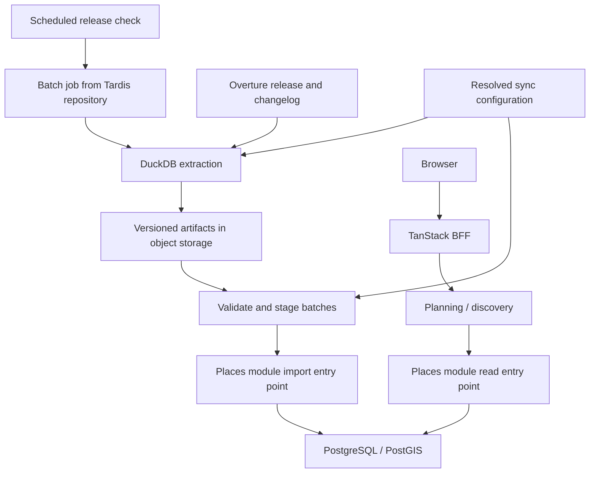

# Configurable Overture Places ingestion

Status: Historical proposal, 2026-09-10. The current import scope and
implementation are in [map-poi-implementation-plan.md](map-poi-implementation-plan.md):
local `regional-poi` covers North America and Europe across five POI groups;
hosted `neon-free` covers US museums and entertainment. The profile examples
below describe the earlier proposal and are not current setup instructions.
Reviewed against the checkout on 2026-10-02.
The configuration and profiles below are design choices, not implemented
settings. The proposal uses a local all-country/all-category profile and a
capacity-limited Neon Free profile for selected US destinations. Remaining
within Neon Free is a capacity goal, not a verified outcome. The places module
exists, but no Overture importer, supporting infrastructure, or schedule exists.

## Recommendation and architecture fit

Use Overture as a periodically refreshed source for the existing places module.
Serve future discovery from PostgreSQL/PostGIS, locally or on Neon. Run ingestion
as a separate batch entry point built from the same repository, sharing the
places module's import contract. The TanStack application remains the public
API and frontend.



The worker owns execution, checkpoints, and source access; places owns identity,
validation, reconciliation, and database writes. Planning uses domain results
without knowing Overture's schema. No source scans occur during HTTP requests.

Proposed code locations:

- `src/jobs/sync-overture-places.ts`: command entry point and run orchestration.
- `src/services/overture/config.ts`: validated sync configuration and named
  profiles; share the resolved configuration between extraction and reconciliation.
- `config/overture/`: versioned profile files and product-category mappings.
- `src/services/overture/`: release discovery, manifests, extraction SQL, and
  conversion into a normalized import contract; no domain table writes.
- `src/modules/places/import.server.ts`: staging, identity matching, and bulk
  reconciliation, exposed through the module's server entry point.
- `src/modules/places/schema.ts`: place ownership, lifecycle, and source tables.
- `src/modules/places/discovery.server.ts`: bounded spatial discovery queries.
- `src/modules/planning/index.server.ts`: composition with event discovery.
- `drizzle/`: additive migrations and ownership constraints.

## Configuration and deployment profiles

Use one importer with configuration, not separate local and hosted importers.
The unrestricted `all` profile is the default when explicitly running a local
sync. It selects every country and category, including gas stations and offices.
"All" refers to selection scope; schema validation, identity preservation,
unknown-hours semantics, and resumable bounded batches still apply.

| Setting | Default / local `all` | Hosted `neon-free` |
| --- | --- | --- |
| Geography | All countries | US: 50 states and Washington, DC |
| Categories | All, including unclassified records | Versioned places-of-interest allowlist below |
| Category exclusions | None | Gas stations, offices, and other exclusions below |
| Places storage budget | No application-imposed ceiling | 150 MB including related tables and indexes |
| Total steady-state database budget | No application-imposed ceiling | 350 MB, with import headroom checked separately |
| Batch size / worker concurrency | Configurable, bounded | Small batches, one worker initially |
| Artifacts | Local filesystem by default | Durable storage outside Neon |
| Schedule | Manual sync; automatic sync disabled | Weekly release check, processing new monthly releases |

Proposed profile configuration (illustrative contract, not an implemented file):

```json
{
  "profile": "neon-free",
  "scope": {
    "countries": ["US"],
    "boundarySet": "us-50-states-dc",
    "categoryGroups": [
      "restaurants", "parks", "museums", "landmarks", "entertainment"
    ],
    "exclusionSet": "places-of-interest-exclusions"
  },
  "limits": {
    "placesStorageBytes": 150000000,
    "databaseStorageBytes": 350000000
  },
  "batchSize": 1000,
  "concurrency": 1,
  "strategy": "snapshot"
}
```

The `all` profile sets `countries` and `categoryGroups` to the explicit value
`"all"`, sets `boundarySet` and `exclusionSet` to null, and sets storage ceilings
to null. Empty arrays mean select nothing, never select everything. Reject
unknown configuration keys, invalid category groups, and invalid limits.
An empty selection must not trigger a mass-retirement reconciliation.

Resolve built-in defaults, then the selected versioned profile, then explicit
job overrides. `OVERTURE_SYNC_PROFILE` selects the profile. CLI options can
override geography, category groups/exclusions, confidence policy, storage
ceilings, batch size, concurrency, release, and snapshot/delta strategy. Do not
put database credentials in profile files or reports. Budget overrides are
checked against hosted deployment ceilings, so a per-run option cannot silently
disable those ceilings. Expanding a hosted deployment requires changing its
explicit deployment policy.

Local app builds and server startup must not download or sync data. Provide a
separate sync command; its local default is comprehensive when the developer
chooses to run it. A production-mode local build still uses local sync settings;
do not infer the database target from `NODE_ENV`.

The Neon deployment and scheduled job must explicitly select `neon-free` and
declare their target. Validate the resolved selection and finite budgets before
extracting or writing. A missing profile on a hosted job is a configuration
error, not permission to fall back to `all`. Also reject the implicit local
default when the connection resolves to a Neon host; running the command on a
laptop does not make its remote database local. Explicit deployment policy is
authoritative, with host detection as an additional misconfiguration check.
Paid Neon deployments can define a wider profile and revised finite budgets
without changing domain code.

Persist the resolved configuration, its selection fingerprint, taxonomy/boundary
versions, and execution limits with each import run. Resume with that frozen
configuration, not newly edited environment variables. An unchanged source
release is a no-op only when the applied selection and mapping versions also
match. Changes to scope require complete reconciliation: expansion imports
newly eligible records, while contraction marks existing records out of scope
without deleting identities or event references. Maintain one active selection
per target database and serialize runs; do not mix profiles against one catalog
as if their watermarks were interchangeable.

## Source contract and hosted category selection

Overture publishes monthly GeoParquet releases and a STAC catalog for discovering
release assets. Pin one release and its asset manifest for the entire run.
[Source access documentation](https://docs.overturemaps.org/getting-data/cloud-sources/).

For the `neon-free` profile, import only US places in an explicit category
allowlist. Apply these filters
during extraction, before loading Neon; excluded categories must not occupy
database space merely because discovery hides them. The geographic default is
the 50 states and Washington, DC, including Alaska and Hawaii; territories can
be added through configuration. Use a versioned geographic boundary for final
point inclusion, with bounding boxes for scan pruning. Address country codes
are useful signals but cannot be the sole filter when addresses are missing.

| Product group | Included destinations | Exclusions |
| --- | --- | --- |
| Restaurants | Restaurant subtypes, including casual dining and fast food | Gas-station listings, grocery/convenience stores, food wholesalers, and corporate offices |
| Parks | Public parks, playgrounds, gardens, and recreation destinations | Parking lots, industrial/business parks, and park administration offices |
| Museums | Museums and visitor-facing museum sites | Administrative offices and non-visitor storage facilities |
| Landmarks | Historic sites, monuments, memorials, scenic viewpoints, and visitor attractions | Ordinary buildings, generic geographic labels, and private residences |
| Entertainment venues | Cinemas, theaters, concert/music venues, comedy clubs, amusement attractions, and spectator venues | Booking agencies, production offices, and equipment suppliers |

These are hosted product groups and examples, not executable Overture category IDs.
Resolve them to exact IDs and descendants in the taxonomy shipped with the
pinned release. Keep the mapping in versioned importer configuration, with
explicit exclusions taking precedence. Do not include entire broad commerce or
services branches, or match category names with substrings. Unknown/unmapped
categories stay excluded in allowlist mode and appear in the profiling report.
The `all` profile retains them without requiring a product-group mapping.

Use primary taxonomy and its hierarchy for eligibility, with `basic_category`
as a validated fallback. Alternate categories alone must not admit a gas station
because it also serves food. A separately identified restaurant can qualify on
its own record even if it shares a site with an excluded business. Standalone
cafes, bars, retail, lodging, and other unlisted groups are outside the initial
allowlist unless explicitly mapped into an agreed included group.

Select named records with valid points, resolvable timezones, and usable
provenance. Record rejection counts by category, state, provider, and reason.
The resolved profile defines the requested scope: do not silently truncate to
the first N records or narrow geography to fit a budget. Use the
[Overture taxonomy explorer](https://docs.overturemaps.org/guides/places/taxonomy-explorer/)
to review mappings, then validate them against the actual release schema.

Persist confidence as a quality signal. Calibrate any publication threshold
against samples from the selected regions and providers rather than treating it
as a universal probability. Start with explicit handling of missing confidence
and permanent/temporary closure. Overture documents duplicates and incomplete
attributes. The September 2026 release removed `categories` in favor of
`taxonomy` and `basic_category`; use the current fields from the start.
[Places guide](https://docs.overturemaps.org/guides/places/) and
[release notes](https://docs.overturemaps.org/blog/2026/09/23/release-notes/).

The Overture place schema has names, points, addresses, taxonomy, contact information,
source information, confidence, and operating status. It does not supply opening
hours or an IANA timezone. Derive timezone using a versioned offline geographic
lookup, record that derivation, and quarantine unresolved points instead of
defaulting to UTC. `operating_status=open` means operating as a business, not
open at the requested instant. Unknown hours and prices stay unknown.
[Place schema](https://docs.overturemaps.org/schema/reference/places/place/).

Preserve multilingual names and structured addresses in source metadata; use a
deterministic display-name and address policy for the existing domain columns.
Keep source categories separately from human-authored tags. Map source taxonomy
to Tardis filters through versioned configuration; importing must not replace a
place's manually assigned tags.

## Domain and persistence changes

The current `places.owner_id` requires a Better Auth user. Introduce
`management_kind = user | catalog` and nullable `owner_id`, with a database check
requiring an owner for user records and no owner for catalog records. Catalog
records are public. Existing rows migrate to `user`; ordinary owner-only writes
must continue rejecting catalog records. The trusted import entry point handles
catalog writes without manufacturing a login account.

Keep Tardis UUIDs as canonical place IDs and map Overture GERS IDs separately.
This preserves event references across imports and permits reviewed identity
reconciliation when upstream identifiers merge, split, or change.

| Storage | Proposed responsibility |
| --- | --- |
| `places` / `locations` | Effective domain name, location, timezone, visibility, management kind, and catalog discovery state. |
| `place_sources` | Unique `(provider, external_id)` mapping to `place_id`; source version, applied release, normalized-content hash, source status, confidence, taxonomy, contact details, provenance/licenses, and artifact reference. Allow retained historical aliases. |
| `place_import_runs` | Source/base/target releases, frozen resolved configuration and selection fingerprint, schema and mapping versions, state, manifest and report URLs, counts, timestamps, error summary, and last completed batch information. |
| `place_import_batches` | Durable partition/batch identity, lease/checkpoint, attempts, counts, and status, unique within a run. |
| Artifact storage | Local files or hosted object storage: pinned manifests, extracted source files, rejected records, and bounded rollback artifacts; retain the previous successful input and the active run. |

Use a narrow source record for online needs; do not retain every source release
as JSON in Neon. Treat source-data version, processing version, and sync time as
different values. An unchanged upstream feature may still need remapping after
a taxonomy or timezone-lookup change.

Imported updates own the catalog's source-derived fields. Hours, exceptions,
prices, descriptions, and manual tags remain separately authored and are never
cleared by sync. Initially catalog source fields are read-only to ordinary
users. If curated corrections to name/location become a requirement, add an
explicit override layer with precedence over source values before enabling
those edits; the importer must not guess whether a value was hand edited.

Preserve the existing immutable-location behavior: changed coordinates or
address create a new location and update the place's reference. Existing events
and occurrences retain their saved location and timezone. Do not mutate a shared
location row and silently move historical events. Reclaim only unreferenced old
locations through a separate retention operation.

## Bootstrap and monthly synchronization

1. **Profile the configured selection.** Pin a release and count matches by category
   and region outside the application database, deduplicating IDs across overlapping groups.
   Measure a representative sample's table and index bytes per accepted place,
   load throughput, update overhead, and dense-city query latency. Extrapolate
   against the filtered counts and compare with current project usage. Report
   restaurants separately so their volume is visible before committing to a load.
2. **Bootstrap the configured selection.** Enumerate assets intersecting the
   configured footprint (all assets for `all`) and apply configured filters. Use DuckDB
   with bounded memory and spill storage; project only needed columns and emit
   partitioned artifacts. Bulk load small staging batches with PostgreSQL COPY,
   reconcile inside places, and promptly clear staging. Avoid keeping a second
   full catalog in Neon. Applicable capacity checks must pass before applying
   the load; local runs still need adequate physical disk and memory.
3. **Check for releases.** Where scheduling is enabled, run a lightweight release
   check weekly, with manual retry support. Import each new monthly release once
   per resolved selection/mapping version; unchanged checks are no-ops.
   This tolerates changes to publication dates. No scheduler should
   create a second active run for the same source.
4. **Refresh the selection.** Start with a complete filtered snapshot and hash
   comparison if the profiling run shows affordable extraction. Update only
   changed rows. Extract the current state of previously imported IDs as well,
   even when they no longer match the allowlist, to distinguish reclassification,
   relocation, closure, and source removal. Only reconcile absence after the
   entire scoped snapshot and tracked-ID lookup are complete.
   If extraction cost justifies deltas, start from the last fully applied release
   and process
   `added`, `data_changed`, and `removed` IDs. Join added/changed IDs to the pinned
   target release to obtain full records; do not assume the changelog contains
   their complete attributes. Resolve records in file groups, using a
   release-compatible registry when useful, rather than one remote lookup per
   ID. Evaluate added/changed records for entry into the selected scope and
   existing IDs for exit from it. Read removed IDs directly from the changelog;
   they cannot be found in the new snapshot. [Changelog contract](https://docs.overturemaps.org/gers/changelog/)
   and [registry documentation](https://docs.overturemaps.org/gers/registry/).
5. **Reconcile idempotently.** Upsert by source identity and content hash, in
   bounded transactions with the batch checkpoint committed in the same
   transaction. Repeating a batch must preserve Tardis IDs and create no duplicate
   places or locations. Serialize releases and reject stale writes. Handle
   known IDs' closure and eligibility changes before applying new-record quality
   filters, so a low-confidence closure cannot be silently discarded.
6. **Complete the release.** Advance the completed-release watermark only when
   all required partitions and count checks pass. Record inserts, changes,
   retirements, unchanged records, rejects, and identity conflicts. Expose the
   last completed release separately from per-record applied releases.
7. **Recover gaps.** Snapshot refresh can proceed directly to the next complete
   release. In delta mode, process consecutive release deltas in order. If an
   intermediate release or compatible changelog is unavailable, or the selection
   policy changes, use the resumable full-snapshot path and reconcile against
   its complete ID set. Schedule periodic reconciliation only after measuring
   its cost; retain the full-snapshot path as a tested recovery tool.

Even with geographic/category filters, deltas may still scan many source files.
Measure extraction cost and choose a full scan when widespread changes make
that cheaper. Bridge files describe source-ID mappings; they are not the update
stream or a guaranteed mapping from an old GERS ID to its successor.

## Deletions, consistency, and recovery

Retire the source association when Overture removes an ID. Keep the canonical
place, event foreign keys, authored data, and last known location. Hide a
catalog-only record from normal discovery when it has no eligible active source;
keep its detail addressable with a clear source-status label. Source removal is
not proof of permanent closure. Never infer removal from a failed extraction,
an empty batch, or an incomplete filtered subset. Track `out_of_scope`
separately from source removal when an existing record no longer matches the
configured selection policy; keep its canonical identity and references. Changes to the
allowlist require a full scoped reconciliation, since unchanged source records
can become newly eligible.

New IDs are new records unless exact identity evidence or a reviewed mapping
links them to an existing place. Name and proximity may generate review
candidates but must not silently merge a user-owned place or reassign events.

Choose bounded-batch consistency for the initial design: readers can briefly
see records from adjacent releases while a sync is applying. A partial failure
leaves committed batches usable and resumes from checkpoints; the completed
release stays unchanged. This avoids a long transaction and two full online
copies of the catalog. If an atomic catalog release switch becomes
a product requirement, introduce versioned source projections and a release
pointer, accepting their extra storage cost.

Validate artifacts before applying them, including schema compatibility,
duplicate IDs, coordinate ranges, timezone resolution, source completeness, and
unexpected state/category count changes. Thresholds come from the profiling
run. Hold suspicious retirement batches for investigation.

Before changing source-managed data, retain before-images for that run's touched
records. Rollback restores only those fields after verifying their applied
release still matches the failed run; it must not overwrite subsequent manual
enrichment. Newly inserted places can be retired on rollback while preserving
references. Pause newer imports during rollback. Test this path without rolling
back the entire shared application database.

## Discovery and API work required

An import alone will not make imported places useful in the current planner:
`findAvailablePlaces` only returns known matching opening intervals. Keep this
strict meaning for availability and offer unknown-hours places through the
proposed discovery contract, clearly labeled. Follow the separation of browsing
and availability in the public discovery proposal.

The current `nearbyLocations` materializes nearby location IDs, and place
availability rejects more than 500 candidates. Replace that path with indexed
SQL joins and eligibility filters before bounded pagination. In strict
availability mode, exclude missing schedules and evaluate schedule eligibility
before result pagination; do not let a catalog of unknown-hours records crowd
out known-open places. Test dense locations and preserve correct pagination.

Discovery should require bounds or center/radius, apply lifecycle/category/
quality filters in SQL, use stable cursor pagination, and batch detail
enrichment. For global, national, and broad regional views, return server-side aggregates or cached
cluster tiles; never send millions of points to MapLibre. Define counts and
freshness explicitly, especially when aggregated results lag a running import.
Use shared eligibility rules for lists and clusters. Keep the existing API
contract compatible and document additive discovery responses in OpenAPI.

Expose provider attribution, catalog freshness, operational status, and unknown
hours through explicit public response fields. Preserve per-source license
metadata and applicable notices in the application and exports. Places sources
have different licenses, including CDLA Permissive, Apache 2.0, and CC0; do not
assign one blanket license to every record.
[Overture attribution](https://docs.overturemaps.org/attribution/).

## Runtime and cost

Use one deployable container containing a pinned DuckDB runtime and the Tardis
TypeScript job. Profile the command locally first. Select a scheduled runner
after measuring extraction duration, memory, and scratch-storage requirements.
If those exceed the available runner allowances, a managed batch platform is
an option; Cloud Run Jobs provides bounded parallelism and retries.
[Job execution documentation](https://docs.cloud.google.com/run/docs/create-jobs).
Choose the host/region after checking proximity to Neon, source-transfer costs,
and scratch-storage needs. Keep the execution command portable.

The following budgets apply to the hosted `neon-free` profile, not the local
`all` profile. As of 2026-10-02, Neon says its Free plan provides 1 GB of
database storage and 100 CU-hours per project per month. Verify the limits for
the target project before implementation; these allowances cover the application
as well as ingestion. [Neon Free plan announcement](https://neon.com/blog/neon-free-plan-1-gb-per-project)
and [pricing](https://neon.com/pricing). US/category filtering reduces volume
but does not establish that the selected catalog fits, especially with
restaurants included. No live project usage or filtered dataset size has yet
been measured.

Use 150 MB for place/location/source tables and indexes as an initial planning
budget, and roughly 350 MB total steady-state project storage as a conservative
target. These are proposed guardrails, not provider limits or measured capacity.
Reserve headroom for growth and bounded import/update overhead;
verify actual headroom before each run. Account for bloat, retained locations,
staging, schema/extension overhead, and other application tables. Keep raw source
and rollback artifacts outside Neon, with a separate storage/runner budget.

The earlier 25,000–50,000-place estimate is a sizing reference, not permission
to truncate the requested US catalog. Compare measured bytes per place and
eligible counts with available capacity. If projected usage exceeds the budget,
produce the per-category size report without applying the import. The next
decision is an explicit category reduction or a paid capacity budget; neither
is automatically authorized. Keep existing data served while a new import is
held. Measure compute consumption and monthly application traffic as well as
storage; staying below the storage allowance alone does not ensure staying within Neon Free.

Set a separate small worker connection pool and cap concurrency to protect API
latency. Use a server-side ingestion credential; keep it out of browser bundles
and public trigger routes. Start with the existing PostgreSQL system and
measure before adding a search engine, broker, or separate places database.

Alert on failed/stalled batches, incomplete manifests, source schema changes,
unexpected retirement volume, excess lag after a release is available, storage
growth, and API latency during loading. Release checks without new data should
stay quiet.

## Delivery sequence and acceptance

1. Validated configuration and profiles, exact hosted US category mapping,
   counts by group/region, source profiling report, capacity estimate, timezone
   lookup choice, and publication-quality policy. Establish whether the hosted
   selection fits Neon Free; measure local resource needs separately.
2. Ownership/source/run schema, trusted import contract, and repeatable sample
   import with identity, immutable-location, and rollback checks.
3. Configurable bootstrap worker, staging/artifact retention, leases, and resumable
   checkpoints; verify every manifest partition is accounted for.
4. Spatial discovery and unknown-hours responses, attribution, dense-area query
   benchmarks, and cluster strategy before exposing the catalog publicly.
5. Monthly filtered refresh and scheduled release checks; add delta processing
   only if measured extraction cost warrants it. Rehearse a missed
   release, schema incompatibility, interrupted batch, closure, upstream ID
   churn, and full-snapshot reconciliation.

Acceptance requires duplicate-free replay, preserved event venues and authored
enrichment, no unknown place represented as open, no retirement after an
incomplete snapshot, authorization preventing user edits to catalog records,
successful selective rollback, and a measured storage/query budget. Hosted selection
checks must reject gas stations and offices, include intended subcategories,
handle Alaska/Hawaii and missing addresses, preserve separate co-located
restaurants, and correctly reconcile records entering or leaving the allowlist.
Configuration checks must verify local default-all behavior, inclusion of
unclassified records in all-category mode, rejection of missing hosted settings,
hosted ceilings after overrides, immutable resume configuration, and full
reconciliation when the profile changes without a new Overture release. Verify
that a local build does not trigger a sync and that a local command targeting
Neon cannot implicitly select the unrestricted profile.
